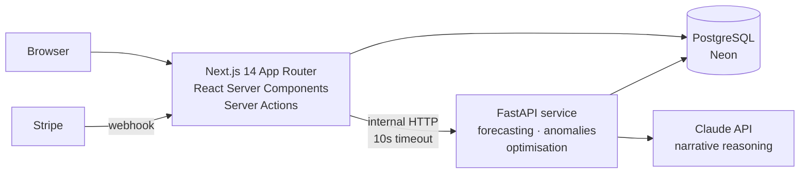

# Suppliq

**An AI-assisted ERP for retail and wholesale businesses.** Point of sale, inventory, procurement, multi-branch stock transfers, customer credit, and expenses in one system, with a separate Python service that layers demand forecasting, reorder recommendations, anomaly detection and cash flow projection on top.

### [→ Try the live demo](https://suppliq-v2.vercel.app/login?demo=true)

No signup required. That link signs you in as a read-only admin on a seeded organisation (Meridian Electronics Ltd, two branches, nine months of trading history). Credentials, if you prefer the normal form: `demo@suppliq.com` / `demo1234`.

Worth a look: the **admin dashboard** (per-branch breakdown, credit exposure, 7-day revenue), **point of sale** (three price tiers, credit sales, printable receipt), **purchase orders** (six-state lifecycle with supplier invoice matching), and **reports** (CSV export, void-and-restore).

---

## What this project is

A full multi-tenant SaaS product built end to end: data model, backend, frontend, authentication, authorisation, billing, a second service in a second language, deployment, and the operational tooling to run it.

It is deliberately not a CRUD demo. The problems that took the most work were the ones that only show up when a system has to be correct: keeping every query scoped to the right tenant, making multi-step money operations atomic, ensuring a price change never rewrites history, and degrading gracefully when a dependency is down.

| | |
|---|---|
| **Scale** | 20 database models, 30 pages, 17 server-action modules, 2 services |
| **Live** | [suppliq-v2.vercel.app](https://suppliq-v2.vercel.app) on Vercel + Neon Postgres |
| **Language** | TypeScript (strict) and Python |

---

## Architecture



**Two services, one database.** The Next.js app owns all writes for business operations. The Python service reads the same Postgres directly and writes only to the `forecasts` table, which keeps the ownership boundary unambiguous and avoids building a synchronisation layer that would have to be kept correct.

**The AI layer is optional by design.** Every call goes through one HTTP client with a uniform timeout, and connection failures are surfaced as `unavailable` rather than thrown. If the Python service is down, the insight pages show an offline state and the rest of the ERP is unaffected. Nothing in the core product depends on it.

**Server Components by default.** Data fetching happens on the server, so no API layer exists purely to feed the frontend. Client components are used only where interactivity requires them: the POS cart, dialogs, and charts.

---

## Engineering decisions

These are the choices that shaped the codebase, and the reasoning behind them.

**Multi-tenancy is enforced at every query, not by middleware.** Every table carries `organizationId`, and each server action derives it from the session rather than accepting it from the client. Mutations re-verify ownership before writing, so a guessed ID fails at the data layer rather than relying on a route guard being present. Branches form a second scope: non-admin users only ever see their own branch's data.

**Money operations are atomic.** A sale writes the sale record, decrements stock across line items, writes stock log entries, and updates the customer's credit balance. Any of those failing alone would corrupt the books, so they run in a single `prisma.$transaction()`. The same applies to recording a payment, receiving a purchase order, dispatching a transfer, and voiding a receipt.

**Prices are snapshotted, never referenced.** `SaleItem.unitPrice` stores the price at the moment of sale. Changing an item's price tomorrow does not silently rewrite last month's receipts or last quarter's revenue report.

**Every stock movement is an immutable log entry.** Sales, voids, purchase receipts, transfers in and out, and manual adjustments all write a `StockLog` row with a reason code and a reference. Current stock is therefore explainable rather than merely present, which is what makes shrinkage detection possible at all.

**Authorisation is checked server-side, twice.** Roles (cashier, manager, admin) gate pages, and the same checks are repeated inside the server actions. No client-side role logic decides access. Plan gating (Starter / Growth / Enterprise) is a separate axis layered on top, so a plan downgrade closes features without touching the role model.

**Subscription state is refreshed without forcing re-login.** Plan lives in the JWT for cheap access, but a Stripe webhook can change it at any moment. The JWT callback re-reads plan and currency from the database every five minutes, so an upgrade takes effect quickly without a session round trip on every request.

**Operational tooling is part of the project.** Deploying this surfaced a class of problem that only exists in production, so the repo includes tooling for it:

| Command | What it does |
|---|---|
| `npm run doctor` | Checks environment variables, database reachability, whether the schema is applied, and whether the demo account is intact. Runs against local or, with `PROD_DATABASE_URL`, a remote database. |
| `npm run db:push-prod` | Applies the schema to a remote database without editing `.env`, normalising the shell-quoting artefacts that otherwise surface as an opaque Prisma `P1013`. |
| `npm run db:seed-prod` | Runs all five seed scripts in dependency order against an explicitly named remote database. Refuses to run against localhost. |
| `npm run db:shift-dates` | Rolls the seeded demo data forward so it always ends today, keeping the live demo current. Idempotent and transactional. |

---

## Features

<details>
<summary><b>Point of sale</b></summary>

Debounced branch-scoped item search by name or SKU. Three price tiers per item (retail, wholesale, special) with the cart repricing instantly on switch. Customer attachment, paid or on-credit payment, discount input with live change calculation. Server-side stock validation before commit. Printable thermal receipt with receipt number, itemised lines, VAT breakdown and QR code.
</details>

<details>
<summary><b>Dashboard</b></summary>

Admin view shows system-wide totals plus per-branch cards: today's revenue, sales count, outstanding credit, low-stock alerts, a 7-day revenue chart, top items and top debtors. Manager and cashier views narrow to their own branch.
</details>

<details>
<summary><b>Inventory</b></summary>

Item records with SKU, category, supplier, three price tiers, cost price, lead time and reorder point. Per-branch stock quantity and low-stock threshold. Soft delete preserves history. CSV import with per-row validation and a skipped-row report.
</details>

<details>
<summary><b>Purchase orders</b></summary>

Six-state lifecycle (draft, sent, confirmed, partial, received, cancelled) supporting partial deliveries. Supplier invoice matching on every order with its own status track, payment recorded against the invoice, and a payables summary by status and supplier.
</details>

<details>
<summary><b>Stock transfers</b></summary>

Branch-to-branch movement with a four-state lifecycle. Dispatch writes a `TRANSFER_OUT` log, receipt writes `TRANSFER_IN`, giving a full audit trail of both legs.
</details>

<details>
<summary><b>Customers and credit</b></summary>

Credit balance tracking that rises on credit sales and falls when payments are recorded, as one atomic operation. Customer detail shows full purchase and payment history, with a printable account statement.
</details>

<details>
<summary><b>Suppliers, expenses, reports</b></summary>

Supplier records with sourced items, order history and total spend. Operating expenses by category, branch-scoped or organisation-wide. Sales report with CSV export, P&L and stock movement reports (Growth plan and above), and admin-only receipt voiding that restores stock atomically.
</details>

<details>
<summary><b>Administration</b></summary>

Employee accounts with role assignment, branch assignment, activation and password reset. Branch management. An immutable audit log of sales, voids, stock movements, order changes, logins and credit payments. Organisation settings for currency, VAT rate, timezone and tax number, which flow through to receipts and documents.
</details>

<details>
<summary><b>AI layer</b></summary>

A FastAPI service providing reorder recommendations (reorder point and economic order quantity, ranked by urgency), overstock detection with capital-tied analysis, inter-branch transfer recommendations, ABC/XYZ classification, anomaly detection across sales, stock and expenses, 30-day cash flow projection, a weekly written briefing, and supply chain market intelligence. Claude generates the plain-English reasoning attached to each recommendation.
</details>

---

## Running locally

Requires Node 20+, Python 3.11+, and Docker (or any PostgreSQL 16 instance).

```bash
git clone https://github.com/janicefoi/suppliq-v2.git
cd suppliq-v2
npm install
cp .env.example .env.local
```

Fill in `.env.local`. At minimum you need `DATABASE_URL`, `DIRECT_URL` and `AUTH_SECRET` (generate one with `openssl rand -base64 32`). Then:

```bash
docker compose up -d
npx prisma db push
npm run db:seed && npm run db:seed-history && npm run db:seed-current && npm run db:seed-stocks && npm run db:seed-events
npm run dev
```

Sign in with `demo@suppliq.com` / `demo1234`. Run `npm run doctor` if anything fails; it reports which layer is at fault.

The AI service is separate and optional:

```bash
cd ai
python -m venv venv && venv/Scripts/activate   # source venv/bin/activate on macOS/Linux
pip install -r requirements.txt
cp .env.example .env                            # needs DATABASE_URL and ANTHROPIC_API_KEY
python -m uvicorn main:app --reload --port 8000
```

---

## Project status

The core ERP is complete and deployed. The demo above runs the production build against a live Postgres instance.

**The AI service is not deployed in the public demo.** It runs locally against the same database, but hosting it requires a separate deployment and an Anthropic API key, so the insight pages in the demo show their offline state. The graceful degradation described above is what you are seeing there.

Next, in priority order:

1. Deploy the FastAPI service and authenticate the boundary between it and the Next.js app with a shared secret, so organisation-scoped endpoints cannot be called directly.
2. Automated test coverage, starting with the money paths: VAT extraction, credit balance arithmetic, void-and-restore, and reorder point calculation.
3. CI running typecheck, lint and tests on every push.
4. Replace the in-process job scheduler with external cron, so scheduled forecasts survive multi-instance deployment.

---

## Author

**Janice Ngugi**
[GitHub @janicefoi](https://github.com/janicefoi)
